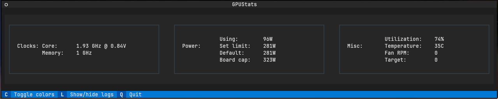
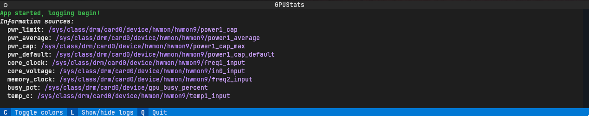

# amdgpu_stats

Simple TUI _(using [Textual](https://textual.textualize.io/))_ that shows AMD GPU statistics:
 - GPU Utilization
 - Temperature
 - Core clock
 - Core voltage
 - Memory clock
 - Power consumption
 - Power limits
   - Default
   - Configured
   - Board capability

## Screenshots

Main screen:

Log screen:

## Requirements

The following unusual modules are required:
 - [textual](https://textual.textualize.io/reference/)
 - [humanfriendly](https://pypi.org/project/humanfriendly/)

This list *may not* be maintained; consider imports / your environment
