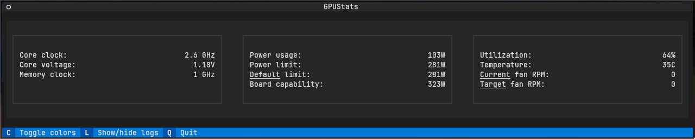
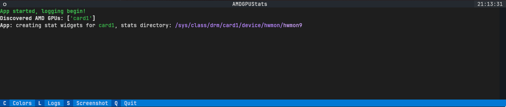

# amdgpu_stats

Simple TUI _(using [Textual](https://textual.textualize.io/))_ that shows AMD GPU statistics:
- GPU Utilization
- Temperatures _(as applicable)_
    - Edge
    - Junction
    - Memory
- Core clock
- Core voltage
- Memory clock
- Power consumption
- Power limits
    - Default
    - Configured
    - Board capability
 - Fan RPM
    - Current
    - Target

Tested _only_ on `RX6000` series cards; more may be supported. Please file an issue if finding incompatibility!

## Requirements
Only `Linux` is supported. Information is _completely_ sourced from interfaces in `sysfs`.

It _may_ be necessary to update the `amdgpu.ppfeaturemask` parameter to enable metrics.

This is assumed present for *control* over the elements being monitored. Untested without. 

See [this Arch Wiki entry](https://wiki.archlinux.org/title/AMDGPU#Boot_parameter) for context.

### Python
The Fedora base repositories provide the requirements with these packages:
 - `python3-humanfriendly`
 - `python3-textual`

See [requirements.txt](requirements.txt) for other distributions

## Screenshots

Main screen:

Log screen:

This is logged:
  - stat _names_ and their `sysfs` files; not values (yet?)
  - toggling Dark/Light mode
